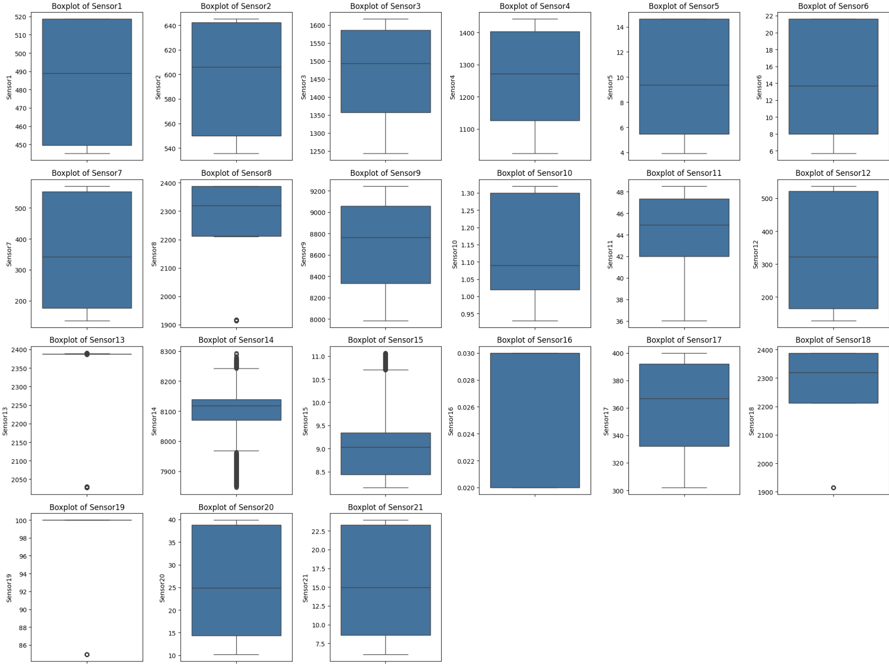
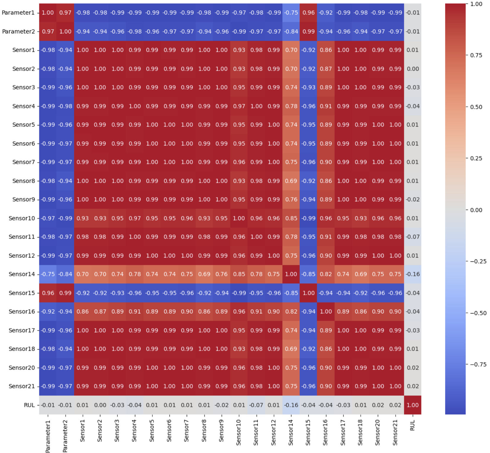

# TurboFan Prediction Project

This project focuses on predicting the performance and maintenance needs of turbofan engines using linear regression models. The aim is to analyze engine data and develop a model to predict future engine behavior and potential failures.

This readme concern the project done in `Projet_soutenance`.

## Table of Contents

- [Project Description](#project-description)
- [Features](#features)
- [Installation](#installation)
- [Usage](#usage)
- [Process Overview](#process-overview)
  - [Outlier Treatment](#outlier-treatment)
  - [Correlation Matrix](#correlation-matrix)
  - [Data Normalization](#data-normalization)
  - [Model Selection](#model-selection)
  - [Cost Function](#cost-function)
- [Results](#results)
- [Contributing](#contributing)
- [License](#license)

## Project Description

The TurboFan Prediction Project utilizes a linear regression model to predict the maintenance requirements of turbofan engines based on historical data. The project involves data preprocessing, model training, and performance evaluation.

## Features

- Data preprocessing and normalization
- Linear regression model training
- Model evaluation with metrics such as Mean Squared Error (MSE), Mean Absolute Error (MAE), and Coefficient of Determination (R^2)
- Visualization of prediction results

## Installation

To set up this project locally, follow these steps:

1. Clone the repository:
   ```sh
   git clone https://github.com/your-username/TurboFanPrediction.git
   cd TurboFanPrediction

## Usage

To use the project, follow these steps:

1. Ensure you have the necessary data files. If not, download them and place them in the appropriate directory.

2. Open the Jupyter notebook:
    ```sh
    jupyter notebook Project_turboFan.ipynb

3. Run the notebook cells sequentially to preprocess the data, train the model, and evaluate the results.

## Process Overview

## Outlier Treatment

Outliers can significantly affect the performance of a regression model. To identify and handle outliers in our dataset, we use box plots (also known as box-and-whisker plots). Box plots provide a graphical representation of the data distribution and highlight the outliers.

### Steps for Outlier Treatment:

1. **Visualize Outliers Using Box Plots:**
   - For each feature in the dataset, create a box plot to visualize the distribution of the data and identify potential outliers.
   - The box plot displays the median, quartiles, and potential outliers (points outside 1.5 times the interquartile range).


   
2. **Identify and Handle Outliers:**

    Calculate the interquartile range (IQR) for each feature.
    Define the lower bound as Q1 - 1.5 * IQR and the upper bound as Q3 + 1.5 * IQR.
    Any data points outside these bounds are considered outliers and can be treated accordingly (e.g., removed or capped).

By visualizing and treating outliers, we ensure that the data used for model training is clean and reliable, leading to better model performance and accuracy.

### Correlation Matrix
A correlation matrix is used to understand the relationships between different features in the dataset. This helps in selecting the most relevant features for the model and eliminating redundant or highly correlated features, which can cause multicollinearity.



### Data Normalization
Data normalization is crucial for ensuring that all features contribute equally to the model. We use the StandardScaler from scikit-learn to normalize the data, transforming it to have a mean of 0 and a standard deviation of 1.

### Model Selection
We use a linear regression model for its simplicity and interpretability. The model is trained on the preprocessed data, allowing us to predict the maintenance needs of the turbofan engines effectively.

### Cost Function
The cost function used in this project is the Mean Squared Error (MSE), which measures the average squared difference between the actual and predicted values. This helps in optimizing the model by minimizing the error.

## Results

The model's performance is evaluated using the following metrics:

-  Mean Squared Error (MSE)
- Mean Absolute Error (MAE)
- Coefficient of Determination (R^2)
The results are visualized using a plot comparing the actual values and the predicted values.

## Contributing

Contributions are welcome! Please follow these steps to contribute:

1. Fork the repository.
2. Create a new branch: `git checkout -b feature/your-feature-name.`
3. Make your changes and commit them: `git commit -m 'Add some feature'`.
4. Push to the branch: `git push origin feature/your-feature-name`.
5. Open a pull request.